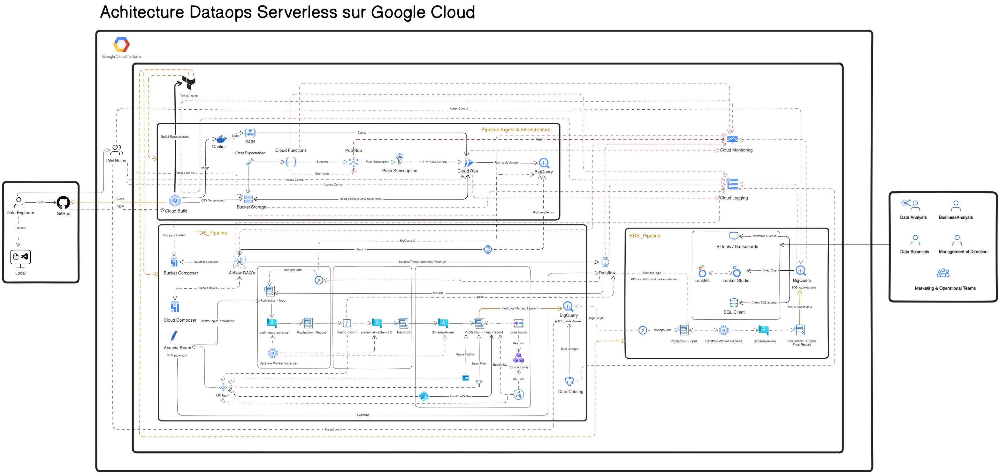

# ⚙️ Architecture DataOps Serverless – Orchestration & Valorisation des Données

## 🎯 Objectif du Projet

Mettre en œuvre une architecture **DataOps serverless** sur Google Cloud, conçue pour orchestrer l’ingestion, la transformation et la valorisation des données métiers via des pipelines automatisés, tout en assurant la scalabilité, la gouvernance et la disponibilité des insights pour les équipes analytiques.

## 🧩 Problématique

Dans un environnement où les volumes et la diversité des données d'inventaire explosent, transformer des données brutes en informations stratégiques devient un véritable défi. Or, les data analysts, avides d’insights pertinents, se retrouvent souvent dépendants des data engineers pour intégrer des logiques métiers complexes dans des systèmes de production rigides. Cette dépendance crée, à mesure que l’entreprise se développe, un goulet d’étranglement et des silos entre équipes, retardant l’accès aux décisions éclairées et freinant l’agilité globale.

## 💡 Solution

Implémentation d’une architecture DataOps serverless reposant sur l’orchestration de trois pipelines complémentaires :

1. **Pipeline d’Ingestion & Provisionnement :**  
   - Provisionnement de l’infrastructure via Terraform (IaC)  
   - Intégration CI/CD avec Cloud Build  
   - Ingestion automatisée des données vers BigQuery

2. **Pipeline de Transformation (ETL) :**  
   - Nettoyage, standardisation et enrichissement des données  
   - Validation des données avec Great Expectations  
   - Suivi du data lineage via Data Catalog

3. **Pipeline de Valorisation Métier :**  
   - Application des logiques métiers pour calcul des KPI  
   - Préparation des données analytiques pour Looker Studio

## 🔐 Sécurité & Supervision

- **IAM & Rôles GCP :** gestion des accès et permissions  
- **Cloud Monitoring & Logging :** supervision et suivi des exécutions  
- **Alerting :** détection proactive des anomalies

## 🛠️ Stack Technique

| Domaine         | Outils / Services GCP                      |
|-----------------|--------------------------------------------|
| Provisionnement | Terraform, Cloud Build                     |
| Orchestration   | Cloud Composer (Airflow)                   |
| Traitement      | Dataflow (Apache Beam), Cloud Functions    |
| Stockage        | BigQuery, Cloud Storage                    |
| Supervision     | Cloud Logging, Cloud Monitoring            |
| Qualité         | Great Expectations, Data Catalog           |

## 🖼️ Schéma d’Architecture

> *NB : Veillez à placer le fichier `Architecture.png` dans le dossier `/images` du projet.*

## 📈 Résultat Attendu

Une chaîne de traitement entièrement automatisée, pilotée par des pipelines orchestrés, fournissant aux data analysts des données structurées, enrichies et fiables, prêtes à l’analyse sans dépendance technique.

---
